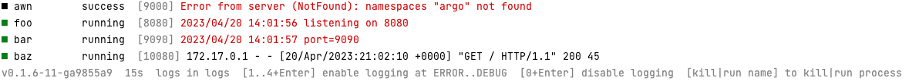

# Kit

This is a tool to enable local development of containerized applications.

It allows you to specify a set of process that run in **containers** or on the **host**. The process are run
concurrently and their status is **muxed into a single terminal** window (so you're not overwhelmed by output). It *
*probes** your processes to see if they've gone wrong, automatically restarting them. When your source code changes,
container and host process **auto-rebuild** and restart. When you're done, **ctrl+c** to
and they're all cleanly stopped. **Logs are captured** so you can look at them anytime.

You could think of it as `docker compose up` or `podman kube play` that supports host processes, or `foreman` that supports containers.

| tool                | container processes | host processes | auto re-build | ctrl+c to stop | terminal mux | log capture | probes |
|---------------------|---------------------|----------------|---------------|----------------|--------------|-------------|--------|
| `kit`               | ✔                   | ✔              | ✔             | ✔              | ✔            | ✔           | ✔      |
| `docker compose up` | ✔                   | ✖              | ✖             | ✖?             | ✔            | ✔           | ✖      |
| `podman play kube`  | ✔                   | ✖              | ✖             | ✖              | ✖            | ✔           | ✔?     |
| `foreman run`       | ✖                   | ✔              | ✖             | ✔              | ✔            | ✖           | ✖      |

Tilt, Skaffold, and Garden are in the same problem space.

## Install

```bash
brew tap alexec/kit --custom-remote https://github.com/alexec/kit
brew install kit
```

## Usage

Describe you application in a [`kit.yaml`](kit.yaml) file, then start:

```bash
kit up
```

You'll see something like this:



Logs are stored in `./logs`.

### Container Process

The `image` field can be either:

1. An conventional image tag. E.g. `ubunutu`.
2. A path to a a directory containing contain a `Dockerfile`, e.g. `.foo`.

If it is a path to a directory containing `Dockerfile`, that file is built, and tagged.

```yaml
    # conventional image? run in Docker
    - name: baz
      image: httpd
    # path image? build and run in Docker
    - name: qux
      image: demo/qux
```

Any container with the same name as the container name in the YAML is stopped and re-created whenever the process
starts.

### Host Process

If `image` field is omitted, the value of `command` is used to start the process on the host:

```yaml
    # no image? this is a host process
    - name: foo
      command: [ go, run, ./demo/foo ]
```

### Auto Rebuild and Restart

You can specify a set of files to watch for changes that result in a re-build:

```yaml
  - build:
      watch:
        - demo/bar
    name: bar
```        

For host processes, you must specify the build command too:

```yaml
  - build:
      command:
        - go
        - build
        - .
      workingDir: demo/bar
    name: bar
```        

### Init Containers

Init containers are started before the main containers. They are allowed to run to completion before the main containers
are started. Useful if you want to do some set-up or build steps.

### Liveness Probe

If the process is not alive (i.e. "dead"), then it is killed and restarted. Just like Kubernetes.

### Quitting

Enter Ctrl+C to send a `SIGTERM` to the process. Each sub-process is then gets sent `SIGTERM`. If they do not exit
within 30s, then they get a `SIGKILL`. You may wish to reduce this number:

```yaml
spec:
  terminationGracePeriodSeconds: 3
```

You can kill the tool using `kill` for another terminal. If you `kill -9`, then the sub-process will keep
running and you must manually clean up.

## Killing One Process

* To kill a host process: `kill $(lsof -ti:$host_port)`
* To kill a container process: `docker restart $name`.

## References

- [Containers from scratch](https://medium.com/@ssttehrani/containers-from-scratch-with-golang-5276576f9909)
