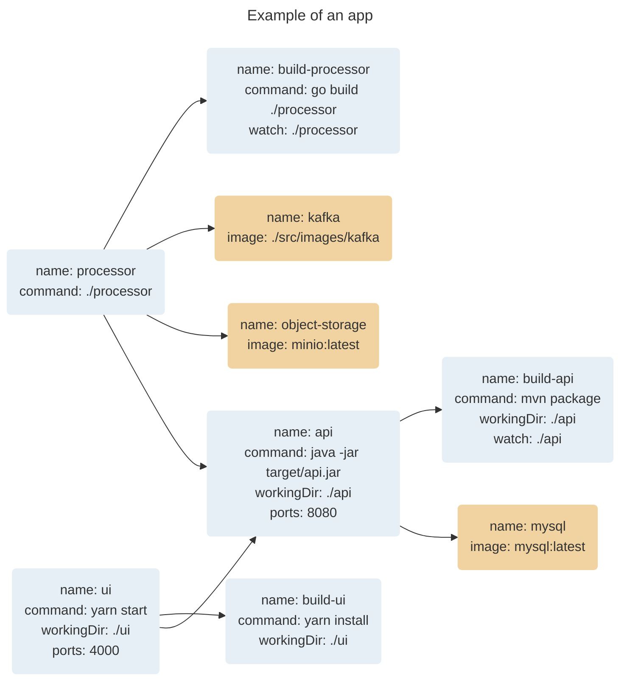

# Kit

[](https://github.com/alexec/kit/actions/workflows/codeql-analysis.yml)
[](https://github.com/alexec/kit/actions/workflows/go.yml)
[](https://github.com/alexec/kit/actions/workflows/goreleaser.yml)

## Why

Make the dev loop crazy fast.

## What

Kit is a software development tool designed to turbo-charge the software development process, with inspiration from several  tools, including Foreman, Docker Compose, Podman, Tilt, Skaffold, and Garden. It combines key features and capabilities of these tools, while also offering additional functionality and flexibility.

It is designed to work seamlessly with both local-dev and cloud-dev environments, such as Codespaces and Gitpod.

Key features of Kit include:

* **Local testing**: Kit is designed for local testing, allowing developers to test their code on their local machines before pushing it to a test environment or production. This speeds up the testing process and helps developers catch and fix bugs more quickly.
* **Advanced DAG architecture**: Kit's directed acyclic graph (DAG) structure allows for optimized parallel processing, reducing the time required for testing and speeding up the development process.
* **Probes**: You can specify liveness probes for your tasks to see if they're working, automatically restarting them when they go wrong. You can also specify readiness probes for your tasks to see if they're ready.
* **Dependency management**: You can specify dependencies between tasks, so when upstream tasks become successful or ready, downstream tasks are automatically started.
* **Comprehensive container management**: Kit can manage both host processes and containers, providing a comprehensive view of the entire software system and quickly identifying any issues or bugs that arise.
* **Automatic rebuilding and restarting**: Kit can automatically rebuild and restart applications in response to changes in the source code or configuration files, allowing developers to test their code quickly and efficiently.
* **Flexible integration and extensibility**: Kit is designed to be highly flexible and extensible, with support for a wide range of programming languages, frameworks, and tools. It can be easily integrated with existing systems and customized to meet specific needs.
* **Terminal output**: Tasks run concurrently and their status is muxed into a single terminal window, so you're not overwhelmed by pages of terminal output.
* **Log capture**: Logs are captured so you can look at them anytime.

Kit was written with extensive help from AI.

## Install

Like `jq`, `kit` is a tiny (8Mb) standalone binary. You can download it from the [releases page](https://github.com/alexec/kit/releases/latest). 

If you're on MacOS, you can use `brew`:

```bash
brew tap alexec/kit --custom-remote https://github.com/alexec/kit
brew install kit
```

Otherwise, you can use `curl`:

```bash
tag=$(curl -s "https://api.github.com/repos/alexec/kit/releases/latest" | jq -r '.tag_name')
version=${tag:1}
curl -Lo kit.tar.gz "https://github.com/alexec/kit/releases/download/${tag}/kit_${version}_$(uname -o)_$(uname -m).tar.gz"
tar -xvf kit.tar.gz kit
chmod +x kit
sudo mv kit /usr/local/bin/kit
```

We do not support `go install`.

## Usage

Apps are described by a DAG, for example:




Create a [`tasks.yaml`](tasks.yaml) file, e.g.:

```yaml
spec:
  tasks:
    - command: go build -v .
      name: build-bar
      watch: demo/bar/main.go
      workingDir: demo/bar
    - command: ./demo/bar/bar
      dependencies: build-bar
      env:
        - PORT=9090
      name: bar
      ports: "9090"
    - dependencies: bar
      name: up
```

Start:

```bash
kit up
```

You'll see something like this:


Logs are stored in `./logs`.

What next?

Open the [docs](docs) to see examples of how to use Kit, as well as the reference.