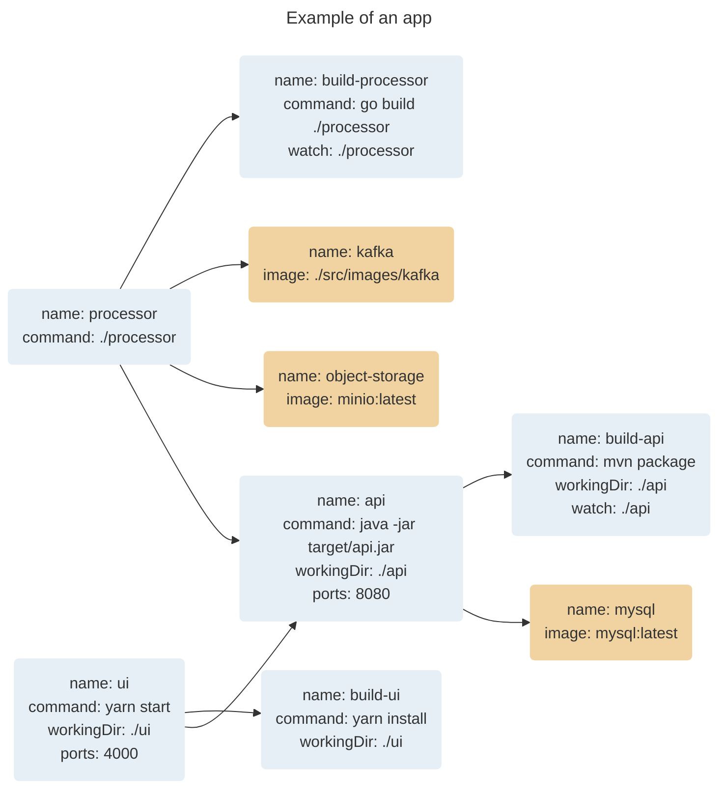

# Kit

[](https://github.com/alexec/kit/actions/workflows/codeql-analysis.yml)
[](https://github.com/alexec/kit/actions/workflows/go.yml)
[](https://github.com/alexec/kit/actions/workflows/goreleaser.yml)

## Why

Make the dev loop crazy fast.

## What

Kit is a  software development tool designed to turbo-charge the software development process, with inspiration from several  tools, including Foreman, Docker Compose, Podman, Tilt, Skaffold, and Garden. It combines key features and capabilities of these tools, while also offering additional functionality and flexibility.

Key features of Kit include:

* **Local testing**: Kit is designed for local testing, allowing developers to test their code on their local machines before pushing it to a test environment or production. This speeds up the testing process and helps developers catch and fix bugs more quickly.
* **Advanced DAG architecture**: Kit's directed acyclic graph (DAG) structure allows for optimized parallel processing, reducing the time required for testing and speeding up the development process.
* **Probes**: You can specify liveness probes for your tasks to see if they're working, automatically restarting them when they go wrong. You can also specify readiness probes for your tasks to see if they're ready.
* **Dependency management**: You can specify dependencies between tasks, so when upstream tasks become successful or ready, downstream tasks are automatically started.
* **Comprehensive container management**: Kit can manage both host processes and containers, providing a comprehensive view of the entire software system and quickly identifying any issues or bugs that arise.
* **Automatic rebuilding and restarting**: Kit can automatically rebuild and restart applications in response to changes in the source code or configuration files, allowing developers to test their code quickly and efficiently.
* **Flexible integration and extensibility**: Kit is designed to be highly flexible and extensible, with support for a wide range of programming languages, frameworks, and tools. It can be easily integrated with existing systems and customized to meet specific needs.
* **Terminal output**: Tasks run concurrently and their status is muxed into a single terminal window, so you're not overwhelmed by pages of terminal output.
* **Log capture**: Logs are captured so you can look at them anytime.

## Install

`kit` is a standalone 8Mb binary (like `jq)`. You can download it from the [releases page](https://github.com/alexec/kit/releases/tag). If you're on MacOS, you can use `brew`:

```bash
brew tap alexec/kit --custom-remote https://github.com/alexec/kit
brew install kit
```

## Usage

Apps are described by a DAG, for example:




Create a [`tasks.yaml`](tasks.yaml) file, e.g.:


```yaml
spec:
  tasks:
  - command: go build -v .
    name: build-bar
    watch: demo/bar/main.go
    workingDir: demo/bar
  - command: ./demo/bar/bar
    dependencies: build-bar
    env:
    - PORT=9090
    name: bar
    ports: "9090"
  - dependencies: bar
    name: up
```

Start:

```bash
kit up
```

## Reference

### Container

The `image` field can be either:

1. An conventional image tag. E.g. `ubunutu`.
2. A path to a a directory containing contain a `Dockerfile`, e.g. `.foo`.

If it is a path to a directory containing `Dockerfile`, that file is built, and tagged.

```yaml
    # conventional image? run in Docker
    - name: baz
      image: httpd
    # path image? build and run in Docker
    - name: qux
      image: demo/qux
```

Any container with the same name as the container name in the YAML is stopped and re-created whenever the process
starts.

### Host Process

If `image` field is omitted, the value of `command` is used to start the process on the host:

```yaml
    # no image? this is a host process
    - name: foo
      command: [ go, run, ./demo/foo ]
```
### Noop

If `image` field is omitted and `command` is omitted, the task does nothing. This is used if you want to start several tasks, and conventionally you'd name the task `up`.

### Auto Rebuild and Restart

You can specify a set of files to watch for changes that result in a re-build:

```yaml
  - watch: demo/bar
    name: bar
```        

### Liveness Probe

If the process is not alive (i.e. "dead"), then it is killed and restarted. Just like Kubernetes.

### Quitting

Enter Ctrl+C to send a `SIGTERM` to the process. Each sub-process is then gets sent `SIGTERM`. If they do not exit
within 30s, then they get a `SIGKILL`. You may wish to reduce this number:

```yaml
spec:
  terminationGracePeriodSeconds: 3
```

You can kill the tool using `kill` for another terminal. If you `kill -9`, then the sub-process will keep
running and you must manually clean up.

## Killing One Process

* To kill a host process: `kill $(lsof -ti:$host_port)`
* To kill a container process: `docker kill $name`.

## References

- [Containers from scratch](https://medium.com/@ssttehrani/containers-from-scratch-with-golang-5276576f9909)
