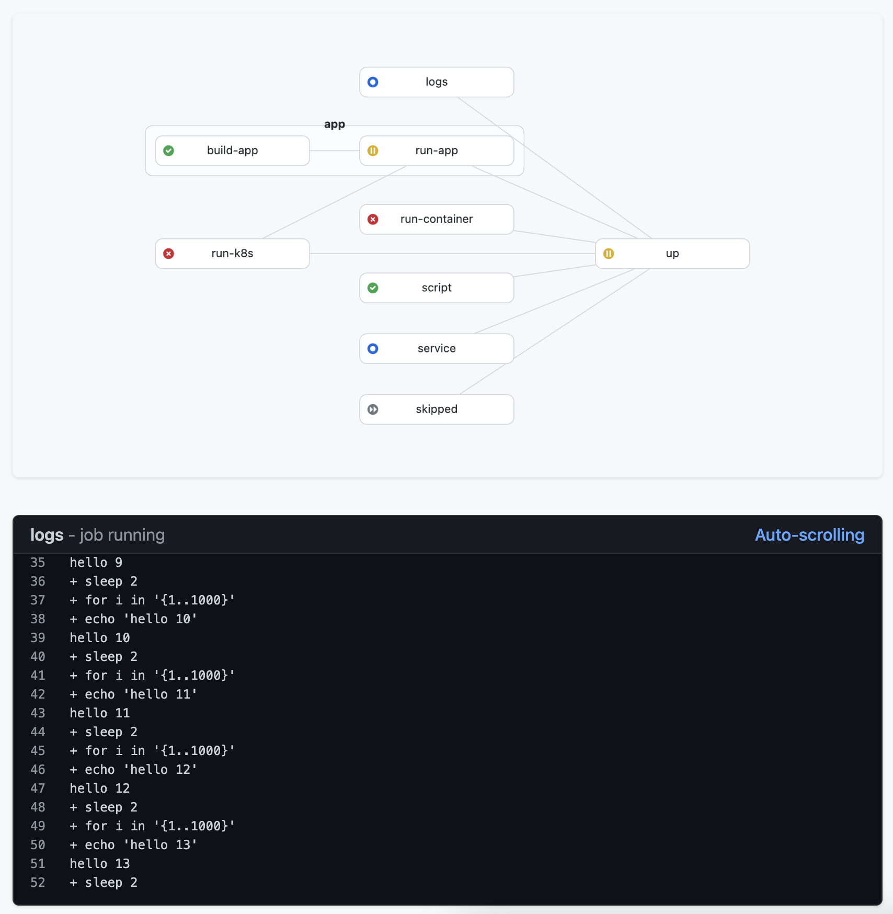

# Kit - Unified Workflow Engine for Software Development

[](https://github.com/kitproj/kit/actions/workflows/codeql-analysis.yml)
[](https://github.com/kitproj/kit/actions/workflows/go.yml)

## What is Kit?

Kit is a powerful workflow engine that simplifies complex software development environments by combining multiple tools into a single binary:

- **Task execution** (like Makefile or Taskfile)
- **Service orchestration** (like Foreman)
- **Container management** (like Docker Compose)
- **Kubernetes resource management** (like Tilt, Skaffold)
- **Local development focus** (like Garden)

With Kit, you can define and manage complex workflows in a single `tasks.yaml` file, making it ideal for projects that require running multiple components simultaneously.



## Key Features

- **Single binary** - Easy to install and use
- **Dependency management** - Define task dependencies in a DAG
- **Multiple task types** - Run commands, containers, Kubernetes resources
- **Auto-restart** - Automatically restart services on failure
- **File watching** - Re-run tasks when files change
- **Port forwarding** - Forward ports from services to host
- **Web UI** - Visualize your workflow and monitor task status with real-time metrics

## Quick Start

### Installation

Download the standalone binary from the [releases page](https://github.com/kitproj/kit/releases/latest):

```bash
# For Linux (amd64)
sudo curl --fail --location --output /usr/local/bin/kit https://github.com/kitproj/kit/releases/download/v1.0.0/kit_v1.0.0_linux_amd64
sudo chmod +x /usr/local/bin/kit

# For Linux (arm64)
sudo curl --fail --location --output /usr/local/bin/kit https://github.com/kitproj/kit/releases/download/v1.0.0/kit_v1.0.0_linux_arm64
sudo chmod +x /usr/local/bin/kit

# For MacOS (Intel)
sudo curl --fail --location --output /usr/local/bin/kit https://github.com/kitproj/kit/releases/download/v1.0.0/kit_v1.0.0_darwin_amd64
sudo chmod +x /usr/local/bin/kit

# For MacOS (Apple Silicon)
sudo curl --fail --location --output /usr/local/bin/kit https://github.com/kitproj/kit/releases/download/v1.0.0/kit_v1.0.0_darwin_arm64
sudo chmod +x /usr/local/bin/kit

# For Go users
go install github.com/kitproj/kit@v1.0.0
```

### Basic Usage

1. Create a `tasks.yaml` file in your project:

```yaml
tasks:
  build:
    command: go build .
    watch: .  # Auto-rebuild when files change
  run:
    dependencies: [build]
    command: ./myapp
    ports: [8080]  # Define as a service that listens on port 8080
```

2. Start your workflow:

```bash
kit run  # Run the 'run' task and its dependencies
```

## Core Concepts

### Jobs vs Services

- **Jobs**: Run once and exit (default)
- **Services**: Run indefinitely and listen on ports

```yaml
# Job example
build:
  command: go build .

# Service example
api:
  command: ./api-server
  ports: [8080]
```

Services automatically restart on failure. Configure restart behavior with `restartPolicy` (Always, Never, OnFailure).

### Task Types

#### Host Tasks

Run commands on your local machine:

```yaml
build:
  command: go build .
```

#### Shell Tasks

Run shell scripts:

```yaml
setup:
  sh: |
    set -eux
    echo "Setting up environment..."
    mkdir -p ./data
```

#### Container Tasks

Run Docker containers:

```yaml
database:
  image: postgres:14
  ports: [5432:5432]
  env:
    - POSTGRES_PASSWORD=password
```

Kit can also build and run containers from a Dockerfile:

```yaml
api:
  image: ./src/api  # Directory with Dockerfile
  ports: [8080]
```

#### Kubernetes Tasks

Deploy and manage Kubernetes resources:

```yaml
deploy:
  namespace: default
  manifests:
    - k8s/
    - service.yaml
  ports: [80:8080]  # Forward cluster port 80 to local port 8080
```

### Advanced Features

#### Task Dependencies

```yaml
test:
  dependencies: [build, database]
  command: go test ./...
```

#### Environment Variables

```yaml
server:
  command: ./server
  env:
    - PORT=8080
    - DEBUG=true
  envfile: .env  # Load from file
```

#### File Watching

```yaml
build:
  command: go build .
  watch: src/  # Rebuild when files in src/ change
```

#### Task Grouping

Organize tasks visually in the UI:

```yaml
tasks:
  api:
    command: ./api
    ports: [8080]
    group: backend
  db:
    image: postgres
    ports: [5432]
    group: backend
  ui:
    command: npm start
    ports: [3000]
    group: frontend
```

## Documentation

- [Examples](docs/examples) - Practical examples (MySQL, Kafka, etc.)
- [Reference](docs/reference) - Detailed configuration options

## Contributing

Contributions are welcome! Please see our [contributing guidelines](CONTRIBUTING.md) for more information.

## License

[MIT License](LICENSE)
