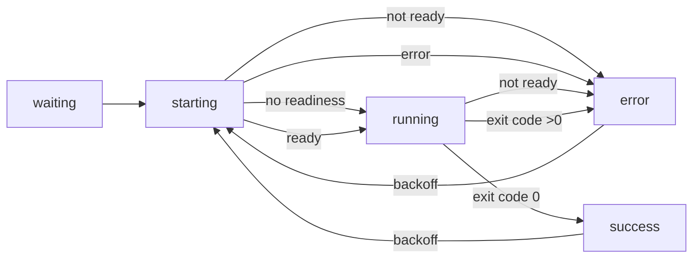

# Status

A process can be in one of the following states:

```mermaid
flowchart LR
    waiting --> starting
    starting -->|no readiness| running
    starting -->|ready| running
    starting -->|not ready| error
    starting -->|error| error
    running --> |not ready| error
    running -->|exit code >0| error
    running -->|exit code 0| success
    error -->|backoff| starting
    success -->|backoff| starting

```